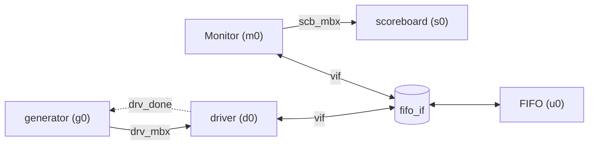

# Environment + Test

Reporte de las clases `environment` y `test` del testbench del FIFO.

## 1. Antes de escribir el código: ¿qué se conecta en estas dos clase?:
Antes de leer el código nos será de utilidad tener claro qué hace cada clase **y qué no hace**.

- `environment` **no genera estímulos, no toca el DUT y no verifica nada**. 
Solo hace dos cosas: construir los cuatro componentes (`generator`, `driver`, `Monitor`, `scoreboard`) y conectarlos entre sí con los canales de comunicación compartidos (mailboxes, evento e interfaz virtual). Después los arranca en paralelo.

- `test` **no tiene lógica propia**. Crea el `environment` y le pide que arranque.

Es decir que ninguna de las dos "hace" la verificación. El trabajo principal es dejar todo cableado para que los otros cuatro componentes puedan tener un canal
de comunicación entre ellos.

### Diagrama de conexiones


## Versión en texto del mismo diagrama


 
Línea continua: `mailbox`. Línea punteada: `event`. Flecha doble: `virtual interface`.
 
### Tabla de conexiones: qué se une con qué
 
| # | Código | Une a | Tipo | Quién pone / quién saca | Para qué |
|---|--------|-------|------|--------------------------|----------|
| 1 | `d0.drv_mbx = drv_mbx;`<br>`g0.drv_mbx = drv_mbx;` | `generator` → `driver` | `mailbox #(fifo_transaction)` | `generator` hace `put()`, `driver` hace `get()` | Pasar las transacciones de estímulo |
| 2 | `d0.drv_done = drv_done;`<br>`g0.drv_done = drv_done;` | `driver` → `generator` | `event` | `driver` lo dispara con `->`, `generator` espera con `@` | Avisar "ya terminé, manda la siguiente" |
| 3 | `m0.scb_mbx = scb_mbx;`<br>`s0.scb_mbx = scb_mbx;` | `Monitor` → `scoreboard` | `mailbox #(fifo_transaction)` | `Monitor` hace `put()`, `scoreboard` hace `get()` | Pasar lo observado para verificarlo |
| 4 | `d0.vif = vif;`<br>`m0.vif = vif;` | `driver` y `Monitor` ↔ `fifo_if` | `virtual fifo_if` | `driver` escribe y lee, `Monitor` solo lee | Dar acceso a las señales reales del DUT |
| 5 | `g0.num = num_transactions;` | `environment` → `generator` | `int` (copia de valor) | `environment` lo copia una vez | Decir cuántas transacciones generar |


Hay **dos clases de conexión**, y acá la diferencia se denota por:
 
- **Referencia compartida** (filas 1 a 4). Se copia el *puntero*, no el contenido. Las dos clases quedan apuntando al **mismo** objeto, como dos personas con la llave de la misma casilla postal. Si cada una tuviera su propio buzón, nunca se comunicarían.
- **Copia de valor** (fila 5). Es un número normal: se copia lo que valga en ese instante y no queda ningún vínculo. Un cambio posterior en `num_transactions` no llega a `g0.num`.

---
 
## 2. Clase `environment`
 
```systemverilog
class environment;
 
    // ---- Componentes ----
    driver      d0;
    Monitor     m0;
    generator   g0;
    scoreboard  s0;
 
    // ---- Canales de comunicación ----
    mailbox #(fifo_transaction) drv_mbx;   // generator -> driver
    mailbox #(fifo_transaction) scb_mbx;   // Monitor   -> scoreboard
    event   drv_done;                      // driver    -> generator
 
    // ---- Interfaz virtual hacia el DUT ----
    virtual fifo_if vif;
 
    // Número de transacciones a generar
    int num_transactions = 20;
 
    function new();
        // 1) Crear los componentes
        d0 = new();
        m0 = new();
        g0 = new();
        s0 = new();
 
        // 2) Crear los canales
        drv_mbx = new();
        scb_mbx = new();
 
        // 3) generator <-> driver: el MISMO mailbox
        d0.drv_mbx = drv_mbx;
        g0.drv_mbx = drv_mbx;
 
        // 4) driver -> generator: el MISMO evento
        d0.drv_done = drv_done;
        g0.drv_done = drv_done;
 
        // 5) Monitor -> scoreboard: el MISMO mailbox
        m0.scb_mbx = scb_mbx;
        s0.scb_mbx = scb_mbx;
    endfunction
 
    task run();
        // Conexiones que dependen de lo que configure tb / test
        d0.vif = vif;
        m0.vif = vif;
        g0.num = num_transactions;
 
        // Arrancar los cuatro componentes en paralelo
        fork
            g0.run();
            d0.run();
            m0.run();
            s0.run();
        join_any
    endtask
 
endclass
```

## 3. Clase `test`
 
```systemverilog
class test;
    environment e0;
 
    function new();
        e0 = new();
    endfunction
 
    task run();
        e0.run();
    endtask
endclass
```
