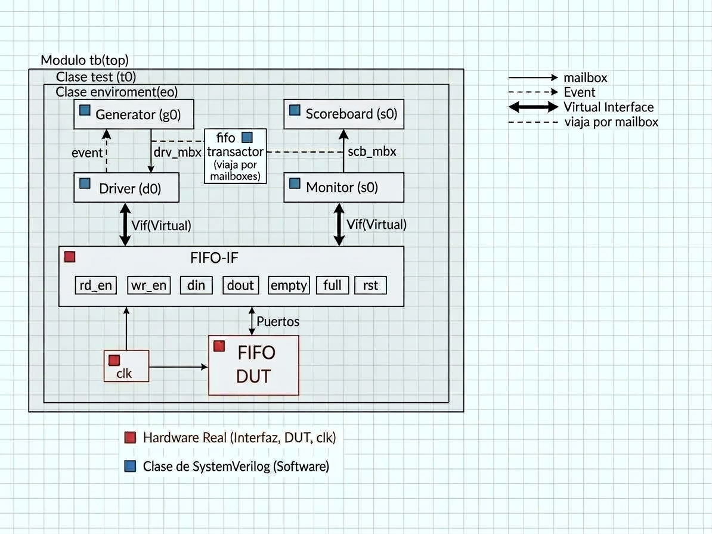

# Environment + Test

Reporte de las clases `environment` y `test` del testbench del FIFO.

## 1. Antes de escribir el código: qué conectan estas dos clases:
Antes de leer el código nos será de utilidad tener claro qué hace cada clase **y qué no hace**.

- `environment` **no genera estímulos, no toca el DUT y no verifica nada**. 
Solo hace dos cosas: construir los cuatro componentes (`generator`, `driver`, `Monitor`, `scoreboard`) y conectarlos entre sí con los canales de comunicación compartidos (mailboxes, evento e interfaz virtual). Después los arranca en paralelo.

- `test` **no tiene lógica propia**. Crea el `environment` y le pide que arranque.

Es decir que ninguna de las dos "hace" la verificación. El trabajo principal es dejar todo cableado para que los otros cuatro componentes puedan tener un canal
de comunicación entre ellos.

### Diagrama de conexiones

