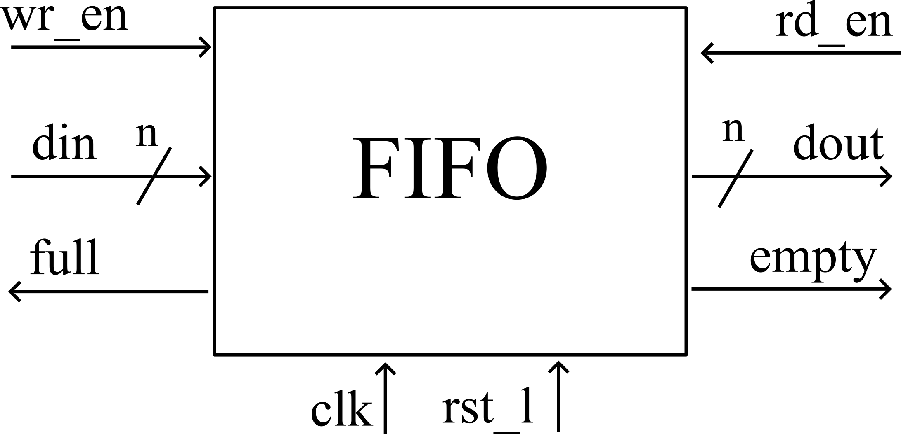
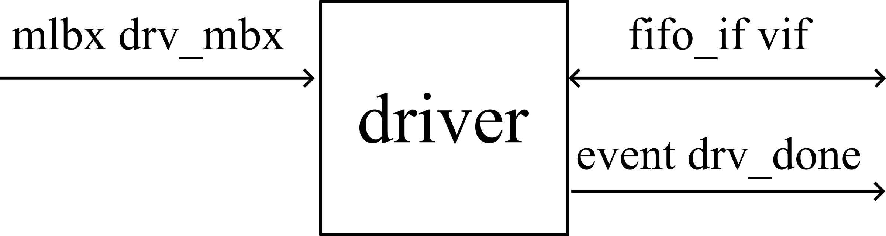
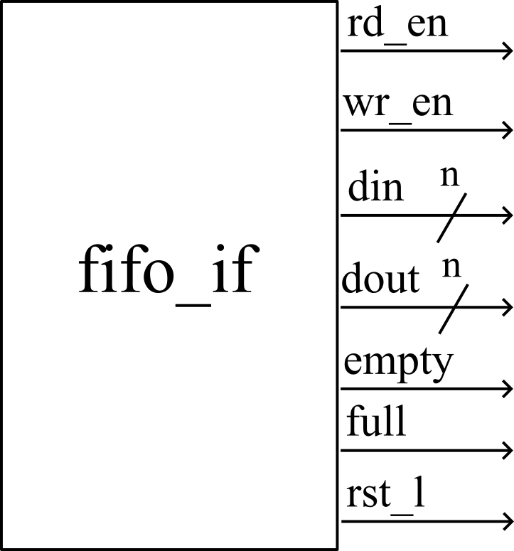
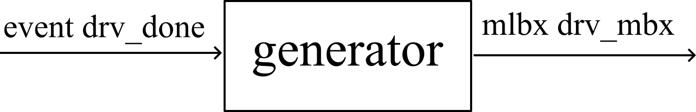
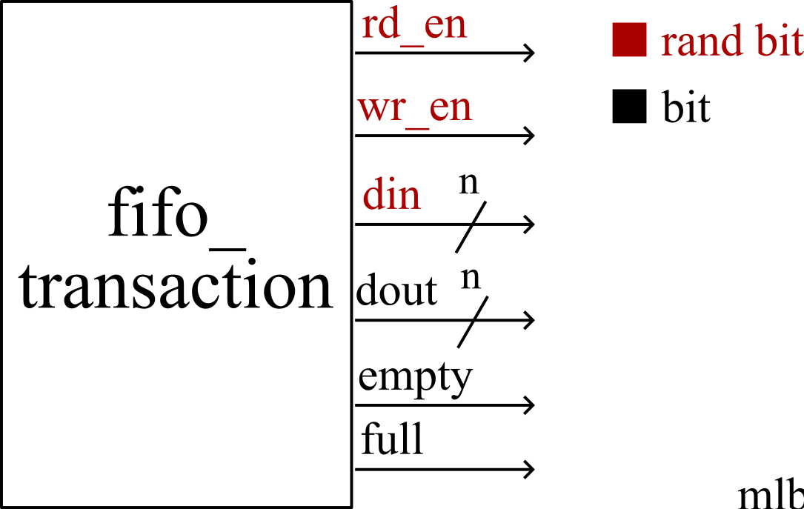
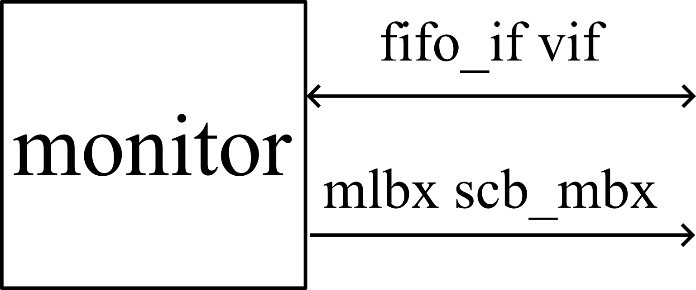

# FIFO UVM testbench
En esta actividad se busca realizar la verificación de funcionamiento del FIFO diseñado.

Las conexiones esperadas de las clases e interfaz diseñadas son las siguientes:

En caso de necesitar modificar alguno para agregar o eliminar alguna señal/señales se debe reportar con una figura que indique a que clase se debe conectar.
Se debe generar un reporte de cada clase diseñada explicando su funcionamiento.
