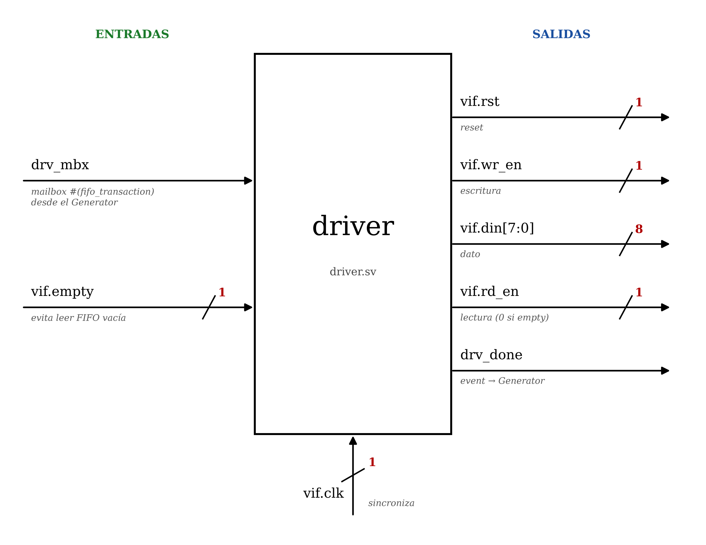
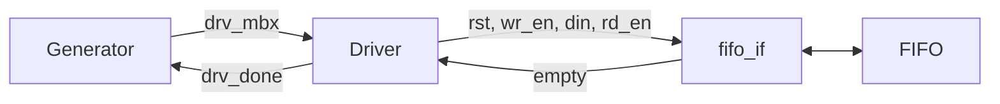

# Driver (`tb/driver.sv`)

El driver recibe las transacciones del generador y las convierte en señales sobre la interfaz `fifo_if`, que llegan a la FIFO. Es la única clase que escribe en la interfaz.

  

## Entradas y salidas

| Señal         | Bits | Dirección | Descripción                                              |
|---------------|:----:|-----------|----------------------------------------------------------|
| `drv_mbx`     | —    | Entrada   | Mailbox con las transacciones del generador              |
| `vif.clk`     | 1    | Entrada   | Reloj para sincronizarse                                 |
| `vif.empty`   | 1    | Entrada   | Indica si la FIFO está vacía                             |
| `vif.rst`     | 1    | Salida    | Reset de la FIFO (activo en bajo)                        |
| `vif.wr_en`   | 1    | Salida    | Habilita escritura                                       |
| `vif.din`     | 8    | Salida    | Dato a escribir                                          |
| `vif.rd_en`   | 1    | Salida    | Habilita lectura (se fuerza a 0 si la FIFO está vacía)   |
| `drv_done`    | —    | Salida    | Evento que avisa al generador que terminó la transacción |

## Funcionamiento

En cada transacción, el driver:

1. Toma una transacción del mailbox `drv_mbx`.
2. En el flanco de bajada del reloj, aplica `rst`, `wr_en`, `din` y `rd_en` a la interfaz.
3. Si la FIFO está vacía, fuerza `rd_en = 0` para evitar lecturas inválidas.
4. Espera el flanco de subida, cuando la FIFO procesa los datos.
5. Dispara `drv_done` para que el generador envíe la siguiente transacción.

## Conexiones

