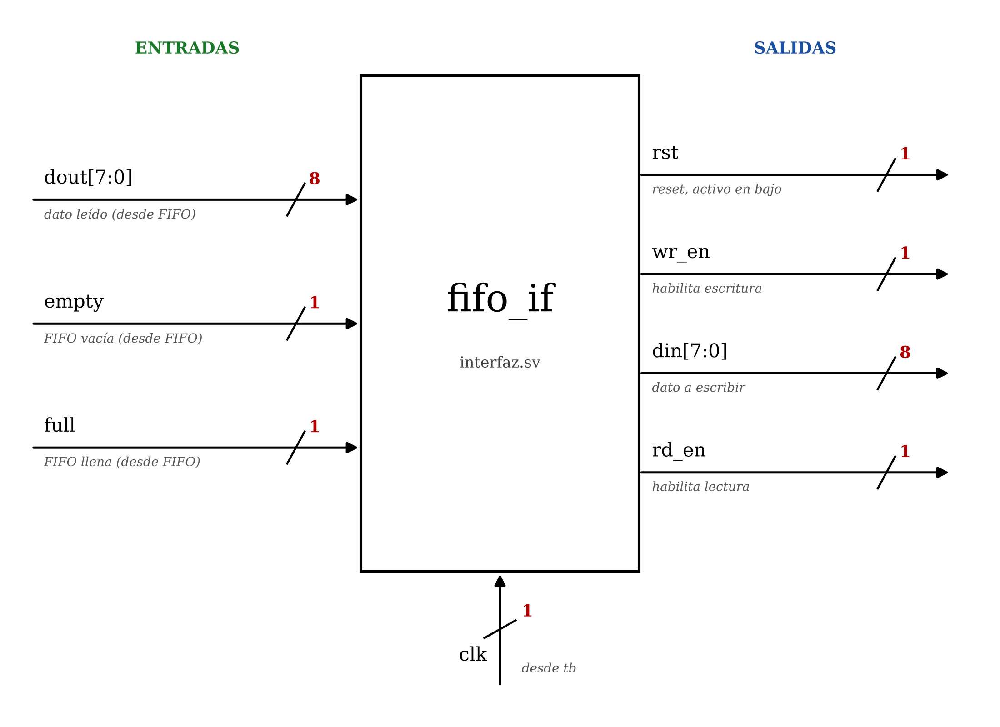
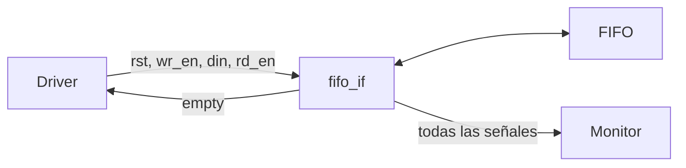

# Interfaz `fifo_if` (`tb/interfaz.sv`)

La interfaz agrupa en un solo bloque todas las señales que conectan el testbench con la FIFO. Es el puente entre las clases de verificación (driver y monitor) y el hardware: las clases acceden a los cables de la FIFO a través de ella.

  

## Entradas y salidas

| Señal   | Bits | Dirección | Descripción                          |
|---------|:----:|-----------|--------------------------------------|
| `clk`   | 1    | Entrada   | Reloj, viene de `tb.sv`              |
| `dout`  | 8    | Entrada   | Dato leído, viene de la FIFO         |
| `empty` | 1    | Entrada   | FIFO vacía, viene de la FIFO         |
| `full`  | 1    | Entrada   | FIFO llena, viene de la FIFO         |
| `rst`   | 1    | Salida    | Reset activo en bajo, hacia la FIFO  |
| `wr_en` | 1    | Salida    | Habilita escritura, hacia la FIFO    |
| `din`   | 8    | Salida    | Dato a escribir, hacia la FIFO       |
| `rd_en` | 1    | Salida    | Habilita lectura, hacia la FIFO      |

## Funcionamiento

- Se instancia en `tb.sv` como `fifo_if _if(clk);` y la FIFO se conecta a sus señales.
- Se entrega a las clases como interfaz virtual (`vif`), lo que les permite leer y escribir los cables reales.
- El **driver** escribe `rst`, `wr_en`, `din` y `rd_en`, y lee `empty`.
- La **FIFO** maneja `dout`, `empty` y `full`.
- El **monitor** solo observa todas las señales.

## Conexiones

